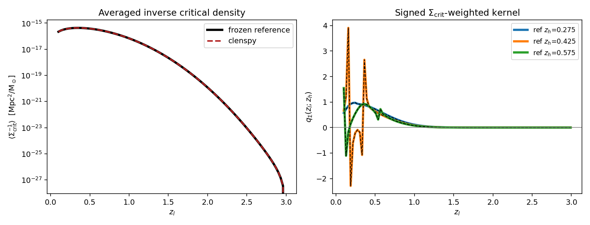

# Validation

`tests/` asks *does it run*. `validation/` asks *does it reproduce a number
someone published, a simulation, or an analytic limit*. Both directories
exist and they are not interchangeable: a comparison against another library
is not a unit test, and running it in CI buys a slow dependency for an
assertion that is usually far looser than the true agreement.

Each script here compares against a **named external reference**, prints the
error norms, exits nonzero on failure, and with `--plot` writes the figure
that shows the agreement.

```bash
python validation/analytic_nfw.py                  # the reference, self-checked
python validation/validate_nfw_pyccl.py    --plot
python validation/validate_twohalo_chain.py  --plot
python validation/validate_lensing_kernel.py --plot   # needs cluster-lensing-cov
python validation/validate_miscentering_table.py      # needs Y3_CLUSTER_CPP_DIR
```

Figures are written to `docs/_static/validation/` so this page can show
them. Regenerating them is part of running the script; they are not
computed at build time.

---

## The transform chain, stage by stage

**Script:** `validation/validate_twohalo_chain.py`
**Reference:** closed-form NFW (`validation/analytic_nfw.py`), Wright &
Brainerd (2000)
**Origin:** `y3_cluster_cpp/validations/second_halo_term/10_chain_residuals.py`,
CLensPy [issue #4](https://github.com/estevesjh/CLensPy/issues/4)

Every code that computes a two-halo term runs the same three transforms:

$$
P(k) \;\longrightarrow\; \xi(r) \;\longrightarrow\; \Sigma(R)
\;\longrightarrow\; \Delta\Sigma(R).
$$

The trick that gives each stage an exact reference is that

$$
\xi(r) = \int \! dk\, \frac{k^2}{2\pi^2}\, P(k)\, j_0(kr)
$$

is the **same integral** as the inverse 3-D Fourier transform of
$\tilde\rho$. So feed a code $P(k) \equiv \tilde\rho_{\rm NFW}(k)$ and it
*must* return $\xi(r) \equiv \rho(r)$; its Abel stage must return the
Wright & Brainerd $\Sigma$; its interior-mean stage must return
$\Delta\Sigma$. A disagreement then localises to one transform instead of
appearing as a single number at the end.


Each panel's inset zooms on the core, $0.1$–$1\,{\rm cMpc}/h$, on a linear
axis at a fixed $\pm 0.01\%$. The thin grey diagonals are the zoom
connectors, not data. On that scale `clenspy` sits on zero everywhere;
`cluster_toolkit`'s $-0.03\%$ $\Sigma$-stage dip and CLMM's ${\sim}0.3\%$
offset are off the inset scale by design.

Absolute fractional residuals, median / max:

| leg | $\rho/\xi$ | $\Sigma$ | $\Delta\Sigma$ | what it tests |
|---|---|---|---|---|
| `cluster_toolkit` | 2.5e-06 / 1.9e-04 | 3.0e-05 / 2.8e-04 | 1.1e-07 / 3.3e-06 | Hankel quadrature; the $-0.03\%$ $\Sigma$ dip at $R=0.1$ is its NFW inner-edge extension |
| `clenspy` | 1.6e-06 / 6.4e-06 | 4.3e-07 / 5.9e-07 | 1.7e-06 / 1.6e-05 | best of the set, once fed its full $k$-window |
| CLMM native NFW | 5.0e-04 / 2.6e-03 | 3.4e-04 / 1.8e-03 | 1.2e-03 / 2.8e-03 | conventions, not transforms — see below |
| CLMM backend ($P$ input) | 4.8e-03 / 6.9e-03 ($r\le5$) | 1.6e-03 / 1.9e-03 | 9.2e-04 / 1.4e-03 | per-transform FFTLog tuning |

### What each leg actually exercises

`cluster_toolkit` — the y3 production engine. `xi.xi_mm_at_r` evaluates the
Hankel integral on a fixed cycle; `deltasigma.Sigma_at_R` does the
line-of-sight Abel integral of $\xi = \rho/\rho_m$ and, below its own grid,
**extends the integrand assuming an NFW$(M,c)$** — that extension is the
source of the $\Sigma$-stage dip; `deltasigma.DeltaSigma_at_R` forms
$\bar\Sigma(<R) - \Sigma(R)$ modelling the interior disc the same way.

`clenspy` — `pk_to_xi_fftlog` (mcfit `P2xi`), then `compute_sigma_grid`
(the Abel integral under $u = t/(1-t)$, 600 nodes), then
`sigma_to_deltasigma_cumtrapz` on a grid extended to $10^{-4}$. Three
constraints on the caller are load-bearing and are recorded as `NOTE:` in
the script:

- the $k$-window must be the full $[10^{-4}, 10^{5}]$; narrower and the
  FFTLog rings below $r \approx 0.3$;
- 600 Abel nodes, not 150, moves that stage from $10^{-5}$ to $6{\times}10^{-7}$;
- the interior mean integrates from $R=0$, so its grid must extend well
  below the smallest output radius.

CLMM native NFW — deliberately different: CLMM's public API is parametric,
so it never sees $\tilde\rho(k)$. It gets only the halo numbers and
evaluates its own NFW formulas. This leg therefore tests **conventions and
normalisation** — mass definition, $\rho_s/r_s$ reconstruction, and the
$1/h$ and $1/h^2$ unit crossings — not transform numerics. Which is exactly
why its residual is a *coherent offset with the same shape in all three
panels* rather than noise. A shape-preserving offset is a normalisation
error; noise is a quadrature error. Reading which one you have is the whole
point of plotting the stages separately.

CLMM backend ($P$ input) — the generic route. `pyccl`'s `HaloProfile`
accepts an arbitrary `_fourier`, so every stage is one FFTLog Hankel
transform of $\tilde\rho$ with no intermediate $\xi$ table: `real` is the
inverse 3-D FT, `projected` is the $J_0$ transform (the Fourier-slice
theorem: the line-of-sight projection of a 3-D field is the 2-D Hankel
transform of its 3-D Fourier transform), and `cumul2d` uses
$2J_1(kR)/(kR)$, the disc average of $J_0$. Its ${\sim}0.1$–$0.2\%$ ripple
is the $k \to 0$ log divergence of the untruncated NFW transform, not a
resolution problem.

### The benchmark halo

Everything derives from a mean-density mass definition on the present-day
(comoving) background — **no redshift anywhere**, so comoving equals
physical and no stray $(1+z)$ can hide:

| quantity | value |
|---|---|
| $\rho_m = \Omega_{m,0}\rho_{c,0}$ | $8.6327\times10^{10}\ M_\odot h^2/{\rm Mpc}^3$ |
| $M_{200m}$ | $10^{14}\ M_\odot/h$ |
| $r_{200m} = [3M/(4\pi\cdot200\rho_m)]^{1/3}$ | $1.1141\ {\rm cMpc}/h$ |
| $c$ | 5 |
| $r_s$ | $0.2228\ {\rm cMpc}/h$ |
| $\delta_c = \frac{200}{3}\frac{c^3}{\ln(1+c)-c/(1+c)}$ | $8694.8$ |
| $\rho_s = \delta_c\rho_m$ | $7.506\times10^{14}\ M_\odot h^2/{\rm Mpc}^3$ |

```{warning}
This script works in the **$h$-ful** convention of the reference libraries —
lengths ${\rm cMpc}/h$, densities $M_\odot h^2/{\rm Mpc}^3$, so $\Sigma$
emerges in $M_\odot h/{\rm Mpc}^2$ and is divided by $10^{12}$ into
$M_\odot h/{\rm pc}^2$ for `cluster_toolkit`. That is **not** `clenspy`'s
$h$-free absolute convention. It is kept because exercising those crossings
is the point of the CLMM legs, and because the residuals are ratios in which
$h$ cancels within each leg.
```

`validation/analytic_nfw.py` is a **deliberate second copy** of formulae
`clenspy.halo.nfw` also carries. A reference that imports the code under
test validates nothing. It is transcribed from Wright & Brainerd (2000) and
checked against direct quadrature by its own `selfcheck`, which agrees to
$10^{-13}$ — so the two implementations are independent and their agreement
is a result rather than a tautology.

---

## `NfwProfile` against `pyccl`

**Script:** `validation/validate_nfw_pyccl.py`
**Reference:** `pyccl.halos.HaloProfileNFW`

All three closed forms `clenspy` carries — $u(k)$, $\Sigma(R)$,
$\Delta\Sigma(R)$ — against `pyccl` with `fourier_analytic`,
`projected_analytic` and `cumul2d_analytic`. Both sides then evaluate closed
forms of the same function, so any disagreement is algebra or normalisation
rather than an integration tolerance.


| comparison | max | rms |
|---|---|---|
| $u(k)$ | 1.0e-10 | 5.2e-11 |
| $u(k)$ truncated | 3.9e-10 | 6.2e-11 |
| $\Sigma(R)$ | 9.2e-11 | 6.1e-11 |
| $\Delta\Sigma(R)$ | 1.3e-09 | 1.7e-10 |

The mass definition has to match on both sides or the comparison is
meaningless: `pyccl`'s `MassDef200m` is 200× the mean matter density, which
is what `NfwProfile` means by `m200` when `rho_ref` defaults to
$\Omega_{m,0}\rho_{c,0}$. Concentration is pinned with
`ConcentrationConstant` so no $c(M)$ relation enters.

```{note}
These four comparisons ran as unit tests with tolerances of $5\times10^{-3}$
against a measured agreement of $10^{-10}$ — seven orders of magnitude of
slack, so they could not have caught anything short of a wholesale error.
As validation scripts they are held at $10^{-8}$, two decades above the
measurement, which leaves room for a library difference while still tripping
on a real algebra change.
```

---

## The lensing kernel

**Script:** `validation/validate_lensing_kernel.py`
**Reference:** `cluster-lensing-cov/validation/frozen_inputs/kernels.npz`

That file was frozen precisely so a refactor could be shown equivalent. It
holds all four quantities `LensingKernel` computes, for a DES Y1 source
population.



| quantity | raw residual | after removing $c^2$ |
|---|---|---|
| $\langle\Sigma_{\rm crit}^{-1}\rangle(z_l)$ | 1.385e-03 | **2.8e-07** |
| $\langle\Sigma_{\rm crit}\rangle(z_h)$ | 1.383e-03 | **2.8e-07** |
| $f_{\rm src}(z_h)$ | 2.8e-07 | — |
| $q_\Sigma(z_l; z_h)$ | 2.8e-07 | — |

The raw 0.138% on the two quantities carrying $c^2$ is **not an error on
either side**: the reference uses $c = 3\times10^5$ km/s where `clenspy`
uses the exact 299792.458, and $(299792.458/3\times10^5)^2 = 0.99861687$
accounts for all of it. The script corrects by that factor to the correct
power — $+1$ for a $\Sigma_{\rm crit}$, $-1$ for its inverse, $0$ for a
probability or a ratio — which is why getting the *direction* wrong showed
up immediately as a doubled residual rather than a halved one.

### Two of these integrals do not converge

$\Sigma_{\rm crit} \propto 1/(\chi_s - \chi_l)$ diverges as
$z_s \to z_l$, so $\langle\Sigma_{\rm crit}\rangle$ and $q_\Sigma$ are
**logarithmically divergent**. Their values are set by two conventions:

- the **minimum lens-source separation**, 0.01 in redshift. A pair closer
  than that is not treated as a lens-source pair at all. This is a
  definition, and `MIN_LENS_SOURCE_SEPARATION` is a floor — asking for less
  raises rather than silently returning a larger number.
- the **node count**, through the first trapezoid interval's weight. With
  the floor in place the integral is finite, but refining the grid *lowers*
  $\langle\Sigma_{\rm crit}\rangle$ rather than settling it: 100 → 800
  nodes moves it 5%. `tests/test_lensing_kernel.py` asserts that
  non-convergence, so nobody "fixes" the node count thinking it is a
  tolerance.

$\langle\Sigma_{\rm crit}^{-1}\rangle$ is the one that *is* convergent —
its integrand vanishes at the edge. That is the deeper reason errata E.1
says to average the inverse: **the other average does not exist without a
convention.**

### $q_\Sigma$ is signed, and its spikes are real

The right-hand panel's excursions to $\pm 4$ are reproduced exactly, and
they are inherited from the definition, not introduced here. Two properties
combine to make them:

- the source range is keyed on $z_l$, **not** on $\max(z_l, z_h)$, so for
  $z_l < z_h$ the integral includes sources in *front* of the halo, where
  $\Sigma_{\rm crit}(z_h, z_s) < 0$. The frozen reference runs from $-2.29$
  to $+3.91$, so a $q_\Sigma$ that is everywhere positive is wrong;
- the same choice puts the $z_s = z_h$ pole *inside* the range, and the
  trapezoid straddles it.

So the spikes are a grid artifact of the upstream definition. They are not
physical, and they are also not ours to smooth: clamping the integrand or
re-keying the range changes the covariance. Recorded here so the shape is
recognised rather than re-derived.

---

## The miscentering table

**Script:** `validation/validate_miscentering_table.py`
**Reference:** `cluster_toolkit.miscentering`, and the y3 tables under
`$Y3_CLUSTER_CPP_DIR/data/nfw_off_center/`

Checks the packaged dimensionless grid `clenspy/data/nfw_miscentering.npz`
against the generator it was built from and against y3's own tables. Skips
itself when `Y3_CLUSTER_CPP_DIR` is unset. The table design, the accuracy
budget, and why `cluster_toolkit` is used above $x_{\rm mis} = 0.1$ and the
by-parts reduction below it are in {doc}`miscentering_math` section 9.

---

## Selection bias and projected density (Costanzi et al. 2026)

The chain under test: `ClusterCounts.average` supplies the bin
$b_{\rm eff}=N[b]/N[1]$; `SelBiasEngine.marginalised_bias(..., b_eff=...)`
supplies $b_{\rm sel}(\theta)$ from the closure described in
{doc}`selection_bias` and derived in {doc}`plan-bsel-stable-closure`;
`SigmaPrj` folds $b_{\rm sel}(\theta)$ into the correlated channel. Two
independent references are used below — a published theory curve with no
sampling noise (a), and a synthetic mock with real shot noise but an
unknown true cosmology (b) — because agreement with only one of them
would leave open whether a residual is a model bug or a reference
artifact.

### a. Costanzi et al. (2026) Fig. 6, digitized

**Script:** `validation/validate_fig6_digitized.py`
**Reference:** `validation/data/costanzi2026_fig6.csv`, hand-digitized from
the paper's own Fig. 6 (the **model** curve, not a mock measurement) —
currently 2 of the paper's 4 richness bins ($\lambda\in[20,30)$ and
$\lambda\in[60,500)$, each at 3 redshift bins); the middle two bins are
not yet digitized.

Because this is a theory curve with no shot noise, any residual is
attributable to a model or input mismatch, not measurement scatter — the
strongest test available. Both plateaus enter
$\langle\Sigma^{\rm prj}\rangle_{\lambda\text{-sel}}/
\langle\Sigma^{\rm prj}\rangle_{\rm RND}$ linearly (fixed geometry,
$\xi_{\rm NL}$, HMF), which is what makes a closed-form
$(b_{\rm small},b_{\rm large})$ fit to the curve possible per panel — used
below as an independent cross-check of the closure, not as a calibration
(the model is never fit to this curve; `excess_delta` has no free
parameters).

| panel | median frac. resid. | max frac. resid. |
|---|---|---|
| $\lambda[20,30)\;z[0.20,0.35)$ | +0.142 | +0.205 |
| $\lambda[20,30)\;z[0.35,0.50)$ | +0.075 | +0.188 |
| $\lambda[20,30)\;z[0.50,0.65)$ | +0.076 | +0.191 |
| $\lambda[60,500)\;z[0.20,0.35)$ | +0.000 | +0.024 |
| $\lambda[60,500)\;z[0.35,0.50)$ | -0.106 | -0.131 |
| $\lambda[60,500)\;z[0.50,0.65)$ | -0.089 | -0.147 |
| **overall (184 points)** | **0.102** | **0.205** |

Before the fix derived in {doc}`plan-bsel-stable-closure`, this same
comparison ran at median 0.51, worst-case 1.10 (the $\lambda[20,30)$
panels were 66–110% high). What is left is a genuinely mixed pattern, not
one uniform offset, and it is now precisely attributed (not merely
consistent-with): `excess_delta`'s $\delta$ gets the mean level right but
has the **wrong-sign redshift trend** — at fixed richness it *falls* with
$z^{\rm ob}$ while the digitized curve needs it to *rise*, confirmed
converged (a $\times1.7$ finer quadrature changes $\delta$ by <0.05%) and
traced to $I_2^{(2)}$ (the correlated-structure second moment) declining
faster with $z$ than $\Delta_{\rm RND}$ grows — see
{doc}`plan-bsel-stable-closure` §9 for the full factor breakdown. This
alone explains the $\lambda[20,30)$ trend (worst at the lowest $z$,
0.142, tapering to $\sim$0.075) once combined with the closure's
already-known $\Delta_{\rm RND}$ mismatch below $z=0.35$ (`_closure`'s
own `NOTE`, 17–50% high there). The $\lambda[60,500)$ sign flip (best at
lowest $z$, turning negative to $-0.106$ at higher $z$) is a second,
separate effect: a $\sim$20–40% low-richness $b_{\rm eff}$ normalisation
offset visible in the closed-form fit (inverting the digitized curve
through the $b_{\rm large}$ side gives an impossible negative $\delta$ in
$\lambda[20,30)$ — {doc}`plan-bsel-stable-closure` §9), independent of
$\delta$'s own $z$-shape problem.

### b. The Costanzi mock catalogue

**Script:** `validation/validate_sigma_prj_mock.py`
**Reference:** `mock_lob_sigma_catalog.fits` under `$SELECTION_BIAS_DIR` —
3,009,025 halos of an octant light-cone dressed with untruncated NFW
profiles and a synthetic redMaPPer richness, storing both
`LAMBDA_TR_LOB` and `LAMBDA_OB_LOB` per halo (recipe: `MOCK_RECIPE.md` in
the same directory) and the target-removed $\Sigma^{\rm prj}(R)$ on 20 log
annuli. Skips itself when the FITS is absent. Cosmology: Buzzard v1.1
($\Omega_m=0.286$, $h=0.7$, $\sigma_8=0.82$, $n_s=0.96$), confirmed
(not assumed) via `costanzi_notebook/cosmology.py`, a verbatim
transcription of the mock-generation notebook's own cosmology cell.

`SigmaPrj`, in the mock-matched configuration (hard $\pm 50\,h^{-1}$cMpc
window, counter-term exclusion, halo-centric truncation at
$30\,h^{-1}$cMpc, `HodMor.buzzard()`), is annulus-averaged on the mock
grid.

```{figure} _static/validation/sigma_prj_ratio_grid.png
:alt: Selected-to-random Sigma_prj ratio, model vs mock, 12 bins
:width: 100%

The selection-bias observable
$\langle\Sigma^{\rm prj}\rangle_{\lambda}/\langle\Sigma^{\rm prj}
\rangle_{\rm RND}$ in the 12 $(\lambda^{\rm ob}, z)$ bins. The random
stack is Hao-Yi Wu's mass-and-redshift weighted estimator.
```

Scored: the two-halo regime, $R>3\,h^{-1}$cMpc, where the per-bin maximum
residual of the ratio is 0.005–0.078 — **12/12 bins pass** at
$\max(2\sigma_{\rm mock},0.02)$; the absolute
$\langle\Sigma^{\rm prj}\rangle$ at $(\lambda^{\rm ob}\approx20,z=0.5)$
agrees to 6.6%. Unscored and reported (the inner aperture, $R\lesssim
2R_\lambda$, is Poisson-starved in the mock and dominated by $b_{\rm
small}$, which this comparison does not have the statistics to score
tightly): $\Delta_{\rm RND}=P_1+b_{\rm eff}I_2$ against the mock's
directly measured $\langle\lambda^{\rm ob}-\lambda^{\rm tr}\rangle$ agrees
to 2–33% (worst at $z<0.35$, the same open issue as in (a)); the
model's own implied $\langle\lambda^{\rm tr}\rangle=\lambda^{\rm ob}-
\Delta_{\rm RND}(1+\delta)$ agrees with the mock's directly stored mean to
better than 3% in all 6 cross-checked bins (median 0.5%) — the tightest
test available, since it probes the closure's one physical input before
the $\times(18\text{–}40)$ gain $A_s$ touches it (see
{doc}`plan-bsel-stable-closure` §6.1).

### c. Numerical methods

Both `SigmaPrj` and `SelBiasEngine` share one line-of-sight recipe
(`utils.los_integrals.LosGeometry`/`integrate_los`): a cosh–Abel
substitution along the line of sight with halo exclusion as an exact
interval boundary, never a mask or a per-redshift grid split — see
{doc}`projection_lensing` ("Exclusion") for the derivation and
{doc}`selection_bias` ("Units and numerics") for how `SelBiasEngine`
reuses it for the $\mathcal P[X]$ operator. $\xi_{\rm NL}$ is clipped at
zero (discards the BAO trough, $O(10^{-4})$ in a $w_z$-suppressed region)
so the operators stay sign-definite. $D=I_2-I_1$ is quadratured directly,
never by float subtraction — real, but not where the closure's
sensitivity actually lives; that derivation, and why the fix is a
different mean-$\lambda^{\rm tr}$ estimator rather than a numerical
patch, is in {doc}`plan-bsel-stable-closure`.

### d. Sensitivity of $b_{\rm sel}$ to the MOR slope $\alpha$

`HodMor.buzzard()`'s mass-richness slope $\alpha=0.859$ is a fit to
DES Y1 NC+3x2pt, not a closed-form number — how much does it drive
$b_{\rm small}$, $b_{\rm large}$? Scaling $\alpha$ by
$\{0.9,1.0,1.1,1.2,1.3,1.5\}$ at fixed $M_{\min}$, $M_1$, $\epsilon$,
$\sigma_{\rm intr}$ (recomputing $b_{\rm eff}$ fresh per variant, since it
depends on the MOR too), both plateaus fall monotonically with $\alpha$ —
a steeper slope widens the halo-mass range mapped to a fixed richness,
pulling in lower-bias halos on average (the same direction found earlier,
by hand, when swapping MORs mid-investigation):

| | $\partial\ln B_{\rm small}/\partial\ln\alpha$ | $\partial\ln B_{\rm large}/\partial\ln\alpha$ | $\partial\ln b_{\rm eff}/\partial\ln\alpha$ |
|---|---|---|---|
| $\lambda[20,30)$ | $-1.15$ to $-1.19$ | $-0.83$ to $-0.91$ | $-0.80$ to $-0.88$ |
| $\lambda[60,500)$ | $-1.81$ to $-1.94$ | $-1.73$ to $-1.85$ | $-1.69$ to $-1.81$ |

$B_{\rm small}$ is consistently the more $\alpha$-sensitive of the two
(1.05–1.4$\times$ larger in magnitude), and both are roughly twice as
sensitive at high richness as at low. Decomposing out $b_{\rm eff}$'s own
$\alpha$-dependence, though, shows the closure's *residual* boost above
$b_{\rm eff}$ ($B/b_{\rm eff}-1$) behaves differently for the two
plateaus: $B_{\rm large}$'s residual boost has a uniform,
richness-independent elasticity of about $-1.25$, while $B_{\rm small}$'s
residual boost is *less* $\alpha$-sensitive at high richness
($-0.21$ to $-0.23$) than at low ($-0.50$ to $-0.54$). So the strong
high-richness sensitivity in the raw table above is mostly $b_{\rm eff}$
tracking the MOR, not the excess-richness closure amplifying it further —
this systematic therefore mostly cancels in a ratio observable that
already divides by $b_{\rm eff}$ (e.g. (b)'s selected/RND ratio), and
matters most for anything that reports $b_{\rm small}$/$b_{\rm large}$ in
absolute units.

### e. Sensitivity of $\Sigma_{\rm prj}$ to $\Omega_m$, $\sigma_8$

The selected/RND ratio — the observable in (b) — is **remarkably
insensitive to cosmology**: at fixed $b_{\rm eff}$, a $\pm10\%$ shift in
either $\Omega_m$ or $\sigma_8$ around the Buzzard fiducial moves the
ratio by well under 1% at every $R$ tested (1–20 cMpc/h), in both the
$\lambda[20,30)$ and $\lambda[60,500)$ bins at $z\approx0.5$:

| bin | $R$ [cMpc/h] | $\partial\ln({\rm ratio})/\partial\ln\Omega_m$ | $\partial\ln({\rm ratio})/\partial\ln\sigma_8$ |
|---|---|---|---|
| $\lambda[20,30)$ | 1 | $-0.021$ | $+0.016$ |
| $\lambda[20,30)$ | 3 | $-0.014$ | $+0.020$ |
| $\lambda[20,30)$ | 10 | $-0.011$ | $+0.009$ |
| $\lambda[20,30)$ | 20 | $-0.009$ | $+0.005$ |
| $\lambda[60,500)$ | 1 | $+0.022$ | $+0.064$ |
| $\lambda[60,500)$ | 3 | $-0.002$ | $+0.038$ |
| $\lambda[60,500)$ | 10 | $-0.009$ | $+0.018$ |
| $\lambda[60,500)$ | 20 | $-0.011$ | $+0.012$ |

$\sigma_8$ dominates over $\Omega_m$ (elasticity 2–6$\times$ larger,
always positive: more clustering amplitude strengthens the correlated
channel the boost model responds to); $\Omega_m$'s effect is small and
sign-mixed. Both are largest near the aperture ($R=1$) and decay toward
the two-halo regime — the *ratio* cancels most of the direct $P(k)$
dependence between its numerator and denominator, leaving only the
residual from $b_{\rm sel}(\theta)$'s own cosmology dependence through
$b_{\rm eff}$/$\Delta_{\rm RND}$. This means the systematic uncertainty
budget for this observable is dominated by the MOR and the closure's
$\delta$ estimate (d, and {doc}`plan-bsel-stable-closure`), not by
cosmological parameter uncertainty. (Scope: $b_{\rm eff}$ was held fixed
across the cosmology grid; letting it respond self-consistently could add
a comparable secondary effect not captured here.)
