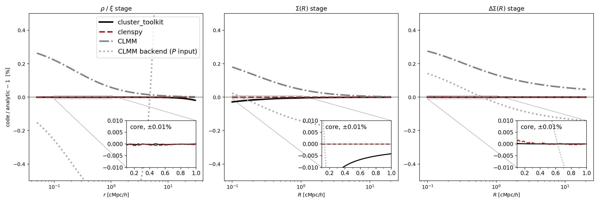
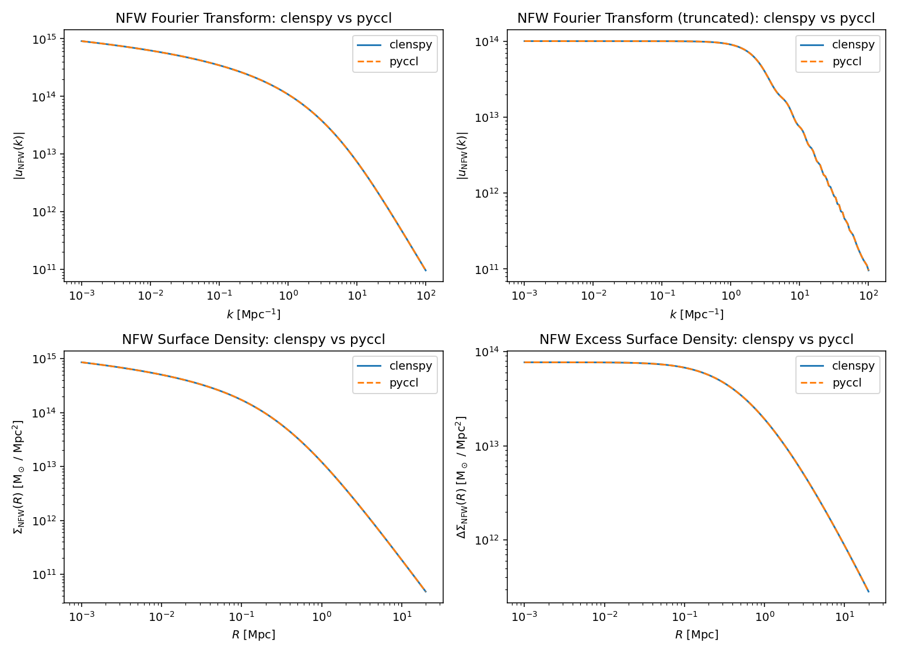

# Validation

`tests/` asks *does it run*. `validation/` asks *does it reproduce a number
someone published, a simulation, or an analytic limit*. Both directories
exist and they are not interchangeable: a comparison against another library
is not a unit test, and running it in CI buys a slow dependency for an
assertion that is usually far looser than the true agreement.

Each script here compares against a **named external reference**, prints the
error norms, exits nonzero on failure, and with `--plot` writes the figure
that shows the agreement.

```bash
python validation/analytic_nfw.py                  # the reference, self-checked
python validation/validate_nfw_pyccl.py    --plot
python validation/validate_twohalo_chain.py --plot
python validation/validate_miscentering_table.py   # needs Y3_CLUSTER_CPP_DIR
```

Figures are written to `docs/_static/validation/` so this page can show
them. Regenerating them is part of running the script; they are not
computed at build time.

---

## The transform chain, stage by stage

**Script:** `validation/validate_twohalo_chain.py`
**Reference:** closed-form NFW (`validation/analytic_nfw.py`), Wright &
Brainerd (2000)
**Origin:** `y3_cluster_cpp/validations/second_halo_term/10_chain_residuals.py`,
CLensPy [issue #4](https://github.com/estevesjh/CLensPy/issues/4)

Every code that computes a two-halo term runs the same three transforms:

$$
P(k) \;\longrightarrow\; \xi(r) \;\longrightarrow\; \Sigma(R)
\;\longrightarrow\; \Delta\Sigma(R).
$$

The trick that gives each stage an exact reference is that

$$
\xi(r) = \int \! dk\, \frac{k^2}{2\pi^2}\, P(k)\, j_0(kr)
$$

is the **same integral** as the inverse 3-D Fourier transform of
$\tilde\rho$. So feed a code $P(k) \equiv \tilde\rho_{\rm NFW}(k)$ and it
*must* return $\xi(r) \equiv \rho(r)$; its Abel stage must return the
Wright & Brainerd $\Sigma$; its interior-mean stage must return
$\Delta\Sigma$. A disagreement then localises to one transform instead of
appearing as a single number at the end.



Each panel's inset zooms on the core, $0.1$–$1\,{\rm cMpc}/h$, on a linear
axis at a fixed $\pm 0.01\%$. The thin grey diagonals are the zoom
connectors, not data. On that scale `clenspy` sits on zero everywhere;
`cluster_toolkit`'s $-0.03\%$ $\Sigma$-stage dip and CLMM's ${\sim}0.3\%$
offset are off the inset scale by design.

Absolute fractional residuals, median / max:

| leg | $\rho/\xi$ | $\Sigma$ | $\Delta\Sigma$ | what it tests |
|---|---|---|---|---|
| `cluster_toolkit` | 2.5e-06 / 1.9e-04 | 3.0e-05 / 2.8e-04 | 1.1e-07 / 3.3e-06 | Hankel quadrature; the $-0.03\%$ $\Sigma$ dip at $R=0.1$ is its NFW inner-edge extension |
| `clenspy` | 1.6e-06 / 6.4e-06 | 4.3e-07 / 5.9e-07 | 1.7e-06 / 1.6e-05 | best of the set, once fed its full $k$-window |
| CLMM native NFW | 5.0e-04 / 2.6e-03 | 3.4e-04 / 1.8e-03 | 1.2e-03 / 2.8e-03 | conventions, not transforms — see below |
| CLMM backend ($P$ input) | 4.8e-03 / 6.9e-03 ($r\le5$) | 1.6e-03 / 1.9e-03 | 9.2e-04 / 1.4e-03 | per-transform FFTLog tuning |

### What each leg actually exercises

`cluster_toolkit` — the y3 production engine. `xi.xi_mm_at_r` evaluates the
Hankel integral on a fixed cycle; `deltasigma.Sigma_at_R` does the
line-of-sight Abel integral of $\xi = \rho/\rho_m$ and, below its own grid,
**extends the integrand assuming an NFW$(M,c)$** — that extension is the
source of the $\Sigma$-stage dip; `deltasigma.DeltaSigma_at_R` forms
$\bar\Sigma(<R) - \Sigma(R)$ modelling the interior disc the same way.

`clenspy` — `pk_to_xi_fftlog` (mcfit `P2xi`), then `compute_sigma_grid`
(the Abel integral under $u = t/(1-t)$, 600 nodes), then
`sigma_to_deltasigma_cumtrapz` on a grid extended to $10^{-4}$. Three
constraints on the caller are load-bearing and are recorded as `NOTE:` in
the script:

- the $k$-window must be the full $[10^{-4}, 10^{5}]$; narrower and the
  FFTLog rings below $r \approx 0.3$;
- 600 Abel nodes, not 150, moves that stage from $10^{-5}$ to $6{\times}10^{-7}$;
- the interior mean integrates from $R=0$, so its grid must extend well
  below the smallest output radius.

CLMM native NFW — deliberately different: CLMM's public API is parametric,
so it never sees $\tilde\rho(k)$. It gets only the halo numbers and
evaluates its own NFW formulas. This leg therefore tests **conventions and
normalisation** — mass definition, $\rho_s/r_s$ reconstruction, and the
$1/h$ and $1/h^2$ unit crossings — not transform numerics. Which is exactly
why its residual is a *coherent offset with the same shape in all three
panels* rather than noise. A shape-preserving offset is a normalisation
error; noise is a quadrature error. Reading which one you have is the whole
point of plotting the stages separately.

CLMM backend ($P$ input) — the generic route. `pyccl`'s `HaloProfile`
accepts an arbitrary `_fourier`, so every stage is one FFTLog Hankel
transform of $\tilde\rho$ with no intermediate $\xi$ table: `real` is the
inverse 3-D FT, `projected` is the $J_0$ transform (the Fourier-slice
theorem: the line-of-sight projection of a 3-D field is the 2-D Hankel
transform of its 3-D Fourier transform), and `cumul2d` uses
$2J_1(kR)/(kR)$, the disc average of $J_0$. Its ${\sim}0.1$–$0.2\%$ ripple
is the $k \to 0$ log divergence of the untruncated NFW transform, not a
resolution problem.

### The benchmark halo

Everything derives from a mean-density mass definition on the present-day
(comoving) background — **no redshift anywhere**, so comoving equals
physical and no stray $(1+z)$ can hide:

| quantity | value |
|---|---|
| $\rho_m = \Omega_{m,0}\rho_{c,0}$ | $8.6327\times10^{10}\ M_\odot h^2/{\rm Mpc}^3$ |
| $M_{200m}$ | $10^{14}\ M_\odot/h$ |
| $r_{200m} = [3M/(4\pi\cdot200\rho_m)]^{1/3}$ | $1.1141\ {\rm cMpc}/h$ |
| $c$ | 5 |
| $r_s$ | $0.2228\ {\rm cMpc}/h$ |
| $\delta_c = \frac{200}{3}\frac{c^3}{\ln(1+c)-c/(1+c)}$ | $8694.8$ |
| $\rho_s = \delta_c\rho_m$ | $7.506\times10^{14}\ M_\odot h^2/{\rm Mpc}^3$ |

```{warning}
This script works in the **$h$-ful** convention of the reference libraries —
lengths ${\rm cMpc}/h$, densities $M_\odot h^2/{\rm Mpc}^3$, so $\Sigma$
emerges in $M_\odot h/{\rm Mpc}^2$ and is divided by $10^{12}$ into
$M_\odot h/{\rm pc}^2$ for `cluster_toolkit`. That is **not** `clenspy`'s
$h$-free absolute convention. It is kept because exercising those crossings
is the point of the CLMM legs, and because the residuals are ratios in which
$h$ cancels within each leg.
```

`validation/analytic_nfw.py` is a **deliberate second copy** of formulae
`clenspy.halo.nfw` also carries. A reference that imports the code under
test validates nothing. It is transcribed from Wright & Brainerd (2000) and
checked against direct quadrature by its own `selfcheck`, which agrees to
$10^{-13}$ — so the two implementations are independent and their agreement
is a result rather than a tautology.

---

## `NfwProfile` against `pyccl`

**Script:** `validation/validate_nfw_pyccl.py`
**Reference:** `pyccl.halos.HaloProfileNFW`

All three closed forms `clenspy` carries — $u(k)$, $\Sigma(R)$,
$\Delta\Sigma(R)$ — against `pyccl` with `fourier_analytic`,
`projected_analytic` and `cumul2d_analytic`. Both sides then evaluate closed
forms of the same function, so any disagreement is algebra or normalisation
rather than an integration tolerance.



| comparison | max | rms |
|---|---|---|
| $u(k)$ | 1.0e-10 | 5.2e-11 |
| $u(k)$ truncated | 3.9e-10 | 6.2e-11 |
| $\Sigma(R)$ | 9.2e-11 | 6.1e-11 |
| $\Delta\Sigma(R)$ | 1.3e-09 | 1.7e-10 |

The mass definition has to match on both sides or the comparison is
meaningless: `pyccl`'s `MassDef200m` is 200× the mean matter density, which
is what `NfwProfile` means by `m200` when `rho_ref` defaults to
$\Omega_{m,0}\rho_{c,0}$. Concentration is pinned with
`ConcentrationConstant` so no $c(M)$ relation enters.

```{note}
These four comparisons ran as unit tests with tolerances of $5\times10^{-3}$
against a measured agreement of $10^{-10}$ — seven orders of magnitude of
slack, so they could not have caught anything short of a wholesale error.
As validation scripts they are held at $10^{-8}$, two decades above the
measurement, which leaves room for a library difference while still tripping
on a real algebra change.
```

---

## The miscentering table

**Script:** `validation/validate_miscentering_table.py`
**Reference:** `cluster_toolkit.miscentering`, and the y3 tables under
`$Y3_CLUSTER_CPP_DIR/data/nfw_off_center/`

Checks the packaged dimensionless grid `clenspy/data/nfw_miscentering.npz`
against the generator it was built from and against y3's own tables. Skips
itself when `Y3_CLUSTER_CPP_DIR` is unset. The table design, the accuracy
budget, and why `cluster_toolkit` is used above $x_{\rm mis} = 0.1$ and the
by-parts reduction below it are in {doc}`miscentering_math` section 9.
